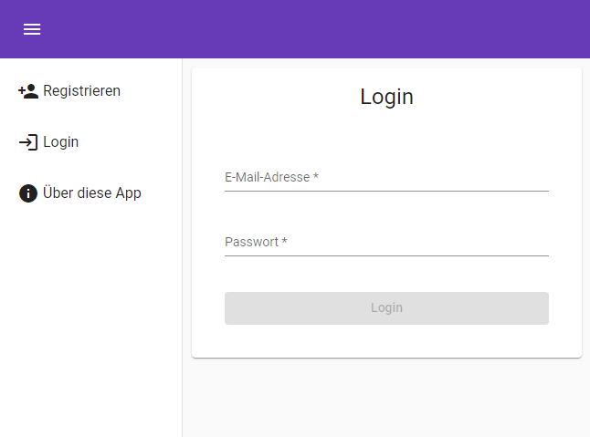
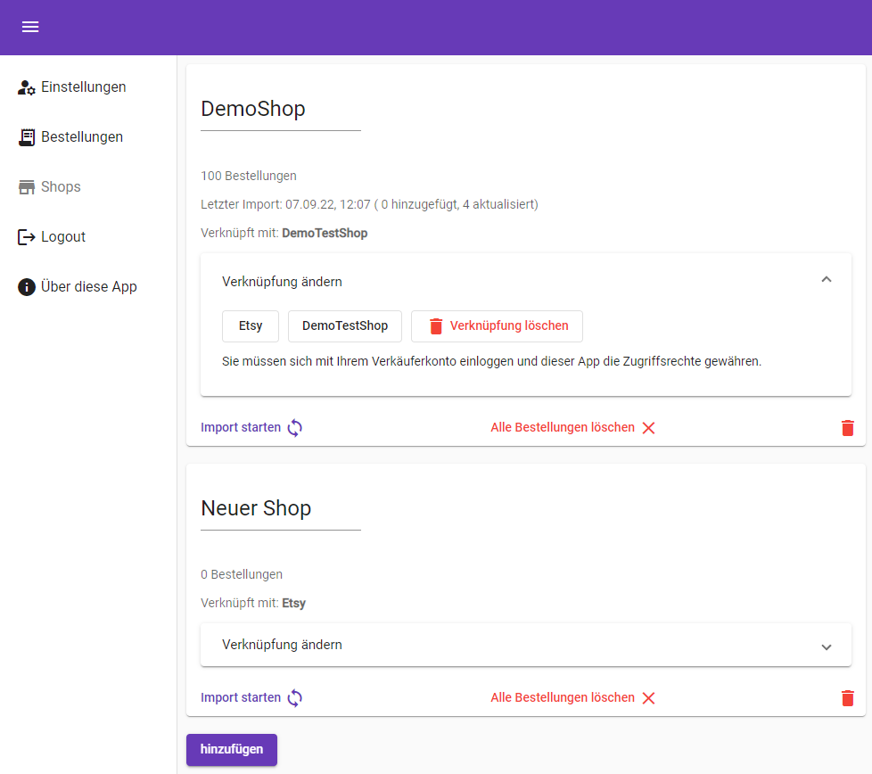
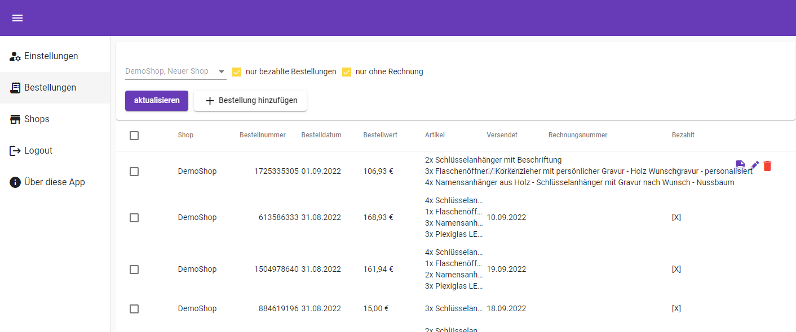
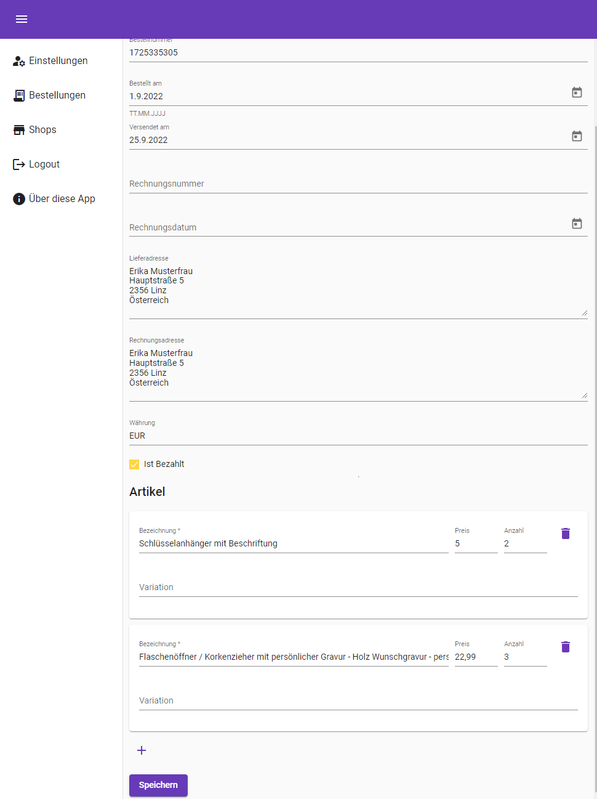
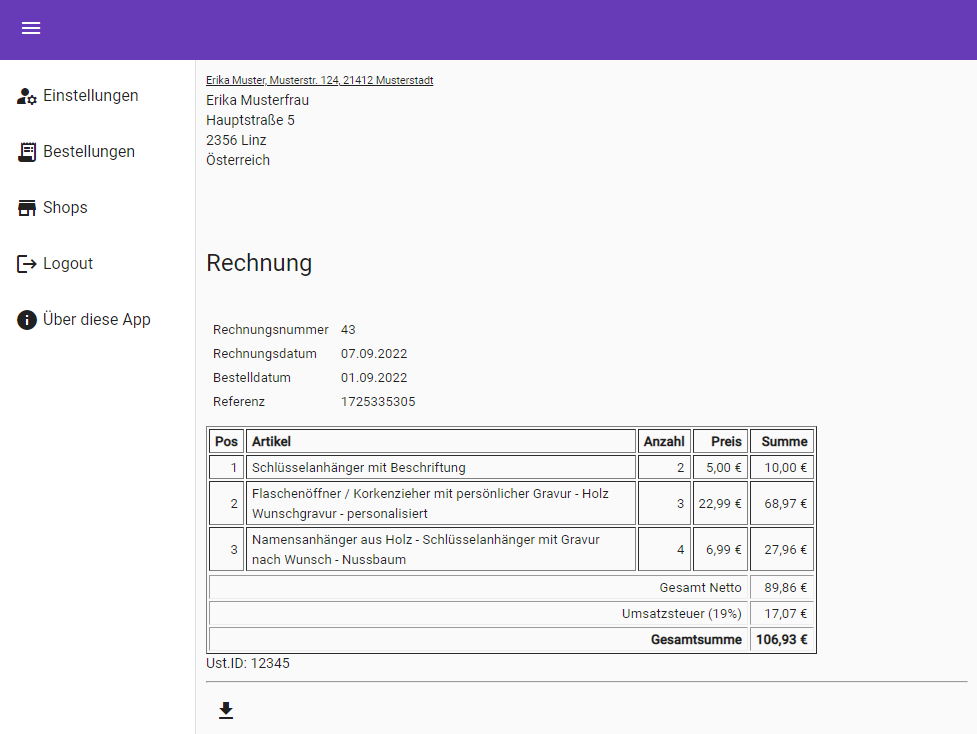

Dies ist eine als Universitätsprojekt entwickelte Web-App zum Verwalten von Warenbestellungen und zum Erzeugen von Nummerierten PDF-Rechnungsdokumenten.

Der Fokus liegt dabei auf dem Verarbeiten von Bestellungen unterschiedlicher Quellen, welche in einem einheitlichen Format gesammelt und unter anderem für Clientseitige Rechnungsgenerierung verwendet werden können.

Die App ermöglicht registrierten Nutzern das manuelle Anlegen von Bestellungen, sowie das Verknüpfen mit einigen Online-Marktplätzen, um Verkäufe in die App importieren zu können.
Auch Testdaten können zu Demonstrationszwecken importiert werden.

Die App verwendet ein .NET 6 Backend mit MongoDB als Datenbankprovider und frontendseitig eine Angular Single-Page-App

